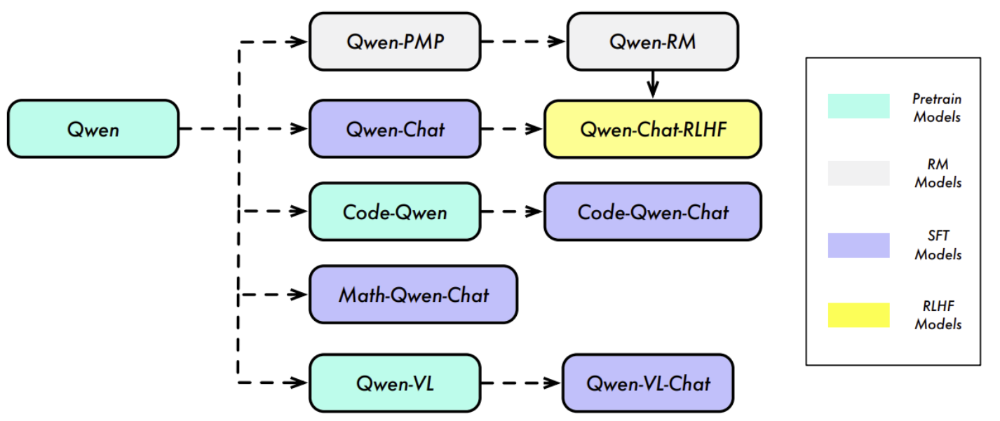
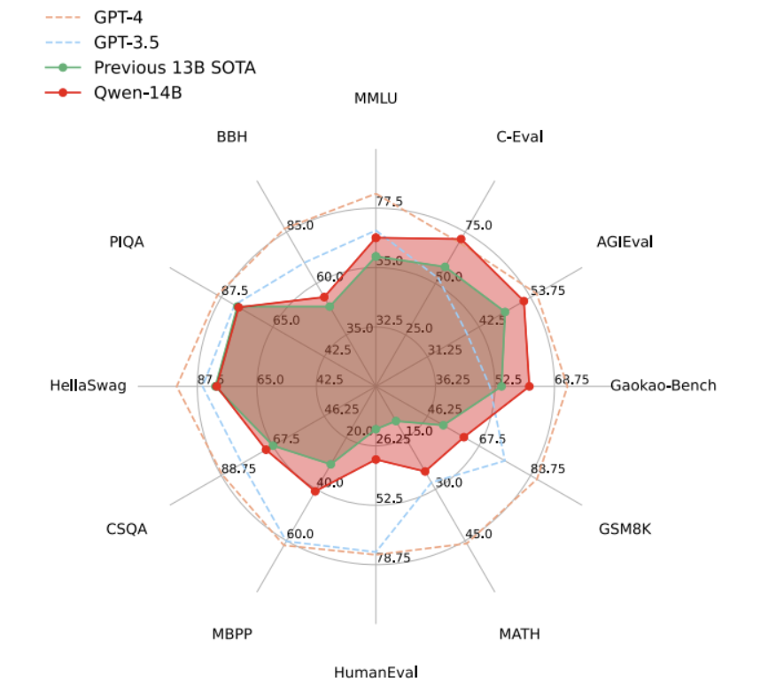
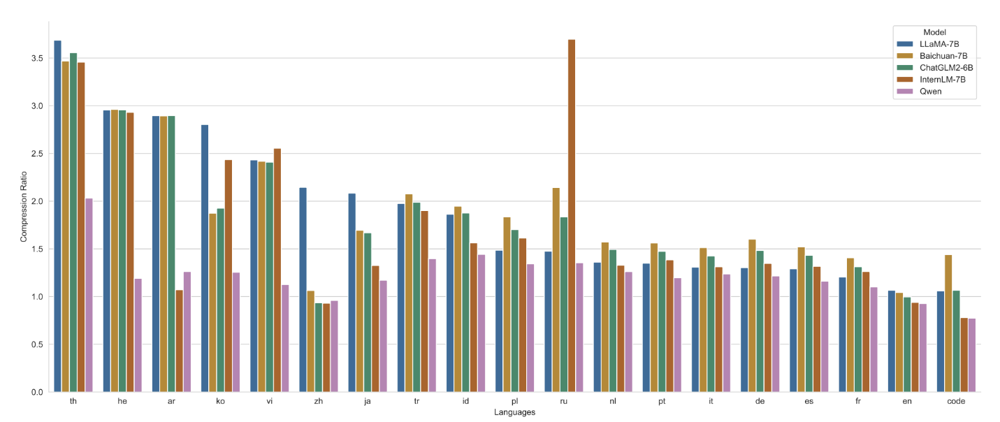
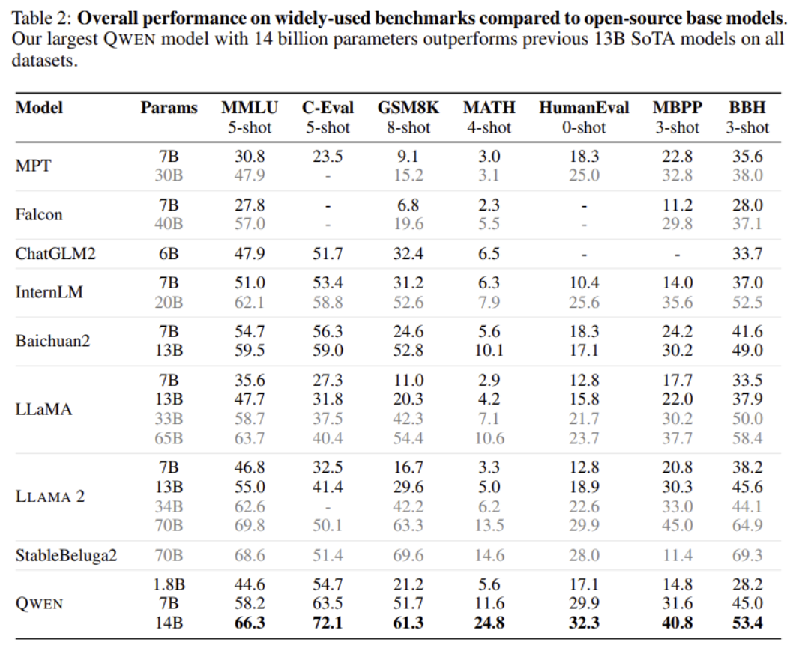
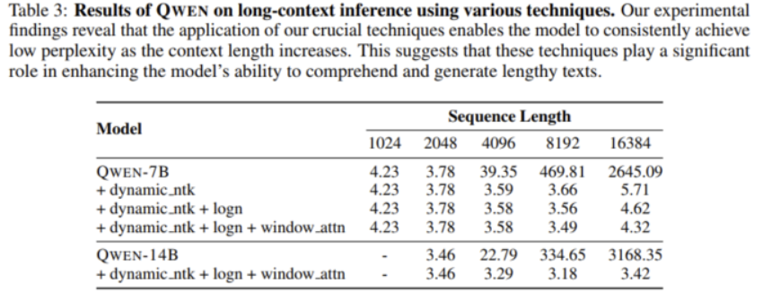

# Qwen 技术报告

## 摘要

大型语言模型（Large Language Models, LLMs）为人工智能领域带来了革命性变革，得以实现此前被认为仅人类可完成的自然语言处理任务。在本研究中，我们正式推出大型语言模型系列的首款模型 —— `通义千问(QWEN)`。通义千问`(QWEN)`是一个覆盖多参数规模模型的综合性语言模型系列，包含两大核心类型：**一是作为预训练基础模型的 “通义千问基础版（QWEN）”**，**二是采用人类对齐技术微调得到的对话模型 “通义千问对话版（QWEN-CHAT）”**。其中，基础语言模型在多项下游任务中均展现出卓越性能；对话模型（尤其是通过人类反馈强化学习`（Reinforcement Learning from Human Feedback, RLHF）`训练的版本）具备极强的竞争力，不仅拥有支持智能体（Agent）应用开发的先进工具调用与规划能力，即便在 “使用代码解释器” 等复杂任务中，与参数规模更大的模型相比也表现亮眼。此外，我们还基于基础语言模型，开发了专注于代码领域的模型（CODE-QWEN 与 CODE-QWEN-CHAT），以及聚焦数学领域的模型（MATH-QWEN-CHAT）。这些专项模型的性能显著优于开源模型，仅略逊于闭源商业模型。

## 1 INTRODUCTION  

**大型语言模型（Large Language Models, LLMs）** `(Radford 等人，2018；Devlin 等人，2018；Raffel 等人，2020；Brown 等人，2020；OpenAI，2023；Chowdhery 等人，2022；Anil 等人，2023；Thoppilan 等人，2022；Touvron 等人，2023a；2023b)`为复杂推理与问题解决任务提供了强大基础，彻底革新了人工智能（Artificial Intelligence, AI）领域。这类模型能够将海量知识压缩至神经网络中，使其成为具备极高通用性的智能体（Agent）。借助对话交互界面，大型语言模型可完成此前被认为仅属于人类专属领域的任务，尤其是涉及创造力与专业知识的任务  `(OpenAI，2022；Ouyang 等人，2022；Anil 等人，2023；Google，2023；Anthropic，2023a；2023b)`。它们能够与人类进行自然语言对话，包括回答问题、提供信息，甚至生成故事、诗歌、音乐等创意内容。这一能力推动了各类应用的发展，覆盖范围从聊天机器人、虚拟助手，到语言翻译与文本摘要工具等多个领域。

- `Radford 等人，2018：《Improving Language Understanding by Generative Pre-Training》，该论文提出了 GPT（Generative Pre-Training）模型，通过大模型预训练 + 子任务微调的方式，在自然语言处理的多个任务中取得了很好的效果。`
- `Devlin 等人，2018：《BERT: Pre-training of Deep Bidirectional Transformers》，论文介绍了 BERT（Bidirectional Encoder Representations from Transformers）模型，通过掩码语言建模等任务进行训练，能够双向理解上下文，在多个自然语言处理任务上取得了当时最优的结果`。
- `Raffel 等人，2020：《Exploring the Limits of Transfer Learning with a Unified Text-to-Text Transformer》，文章提出了基于 Encoder-Decoder 架构的模型 T5（Text-to-Text Transfer Transformer）和数据集 C4（Colossal Clean Crawled Corpus），并通过一系列实验验证了大模型性能的影响因素。`
- `Brown 等人，2020：《Language models are few-shot learners》。`
- `OpenAI，2023：《GPT-4 Technical Report》，该报告介绍了 OpenAI 的 GPT-4 模型，详细阐述了模型的架构、训练方法以及在各种任务上的性能表现。`
- `Chowdhery 等人，2022：《PaLM: Scaling Language Modeling with Pathways》，论文介绍了 Google 的 PaLM（Pathways Language Model）模型，该模型参数高达 5400 亿，利用 Pathways 多机调度系统进行训练，在数百项任务上实现了 Few-shot 学习的最优性能。`
- `Anil 等人，2023：《PaLM 2 technical report》`
- `Thoppilan 等人，2022：《LaMDA: Language Models for Dialog Applications》，论文介绍了斯坦福和谷歌联合提出的 LaMDA（Language Models for Dialog Applications）模型，这是一个用于对话的语言模型。`
- `Touvron 等人，《LLaMA: Open and efficient foundation language models》《Llama 2: Open Foundation and Fine-Tuned Chat Models》，论文介绍了 Llama 2 模型，包括其基础模型和微调的聊天模型，展示了 Llama 2 在多个任务上的性能表现。至于 Touvron 等人 2023b 的论文，根据现有信息无法准确确定其具体内容。`

大型语言模型（LLMs）的能力并非仅局限于语言类任务，它们还可作为**通用智能体**`（generalist agent）（Reed 等人，2022；Bai 等人，2022a；Wang 等人，2023a；AutoGPT，2023；Hong 等人，2023）`，通过与外部系统、工具及模型协作，实现人类设定的目标。例如，**大型语言模型能够理解多模态指令**`（OpenAI，2023；Bai 等人，2023；Liu 等人，2023a；Ye 等人，2023；Dai 等人，2023；Peng 等人，2023b）`、**执行代码**`（Chen 等人，2021；Zheng 等人，2023；Li 等人，2023d）`、**调用工具**`（Schick 等人，2023；LangChain, Inc.，2023；AutoGPT，2023）`等。这为人工智能应用开辟了全新的可能性，应用场景从自动驾驶、机器人技术，延伸至医疗健康与金融领域。随着这类模型持续演进与优化，未来数年我们有望见证更多创新且极具价值的应用落地。无论是协助人类解决复杂问题、创造新型娱乐形式，还是改变我们的生活与工作方式，大型语言模型都将在塑造人工智能未来的进程中，扮演核心角色

`图 1：通义千问（Qwen）系列模型谱系我们在包含万亿级 token 的海量数据集上，对 “通义千问基础版（QWEN）” 语言模型进行了预训练。随后，通过有监督微调（Supervised Fine-Tuning, SFT）与人类反馈强化学习（Reinforcement Learning from Human Feedback, RLHF）技术，使模型对齐人类偏好，进而得到 “通义千问对话版（QWEN-CHAT）”，以及经过专项优化的改进版本 “QWEN-CHAT-RLHF”。此外，我们还基于通义千问基础模型，采用类似技术路线，开发了面向代码与数学领域的专项模型，例如 “代码版通义千问（CODE-QWEN）”“代码对话版通义千问（CODE-QWEN-CHAT）” 及 “数学对话版通义千问（MATH-QWEN-CHAT）”。需说明的是，我们此前已发布多模态大型语言模型 “通义千问视觉版（QWEN-VL）” 与 “通义千问视觉对话版（QWEN-VL-CHAT）”（Bai 等人，2023），这两款模型同样基于通义千问基础模型构建。`

尽管大型语言模型（LLMs）具备令人瞩目的能力，但其在**可复现性**、**可控性**以及对服务提供商的**可及性**方面存在不足，这一点也常遭诟病。在本研究中，我们荣幸地推出并开源大型语言模型系列的初始版本 —— 通义千问（QWEN）。“QWEN” 一词源自中文 “千问”，字面意为 “数千个提示词（prompts）”，蕴含着接纳各类问题、响应多元需求的设计理念。通义千问（QWEN）是一个覆盖多参数规模模型的综合性语言模型系列，包含三大核心类型：一是预训练基础语言模型；二是通过人类对齐技术（即有监督微调`（Supervised Fine-Tuning, SFT）`、人类反馈强化学习`（Reinforcement Learning from Human Feedback, RLHF）`等）微调得到的对话模型；三是面向代码与数学领域的专项模型。具体细节如下：

1. 通义千问基础版模型（QWEN）的训练数据规模庞大，涵盖文本、代码等多元内容，token 总量最高达 3 万亿。即便与参数规模显著更大的模型相比，该基础模型在多项下游任务中仍持续展现出更优性能。
2. **通义千问对话版模型（QWEN-CHAT）的微调过程基于精心筛选的数据集，该数据集覆盖任务执行、对话交互、工具调用、智能体（Agent）开发、安全合规等多个维度**。基准测试结果显示，经有监督微调（SFT）训练的模型已能实现卓越性能；此外，我们还训练了模拟人类偏好的**奖励模型**（Reward Model），并将其应用于对话模型的**人类反馈强化学习（RLHF）**流程，最终得到符合人类偏好的模型输出。通过高难度测试集的人工评估发现，经 RLHF 训练的 QWEN-CHAT 模型具备极强竞争力，但在我们的基准测试中仍略逊于 GPT-4。
3. 同时，我们推出了代码专项模型 CODE-QWEN，包含 CODE-QWEN-7B、CODE-QWEN-14B 两个基础版本，以及对应的对话版本 CODE-QWEN-7B-CHAT、CODE-QWEN-14B-CHAT。具体而言，CODE-QWEN 先在大规模代码数据集上完成预训练，随后通过进一步微调，具备处理代码生成、调试、解释等对话场景的能力。在 HumanEval（Chen 等人，2021）、MBPP（Austin 等人，2021）、HumanEvalPack（Muennighoff 等人，2023）等基准数据集上的实验结果表明，CODE-QWEN 在代码理解与生成任务中展现出高水平能力。
4. 本研究还引入了专为解决数学问题设计的模型 MATH-QWEN-CHAT。结果显示，MATH-QWEN-7B-CHAT 与 MATH-QWEN-14B-CHAT 两款模型，在同参数规模的开源模型中性能优势显著；在 GSM8K（Cobbe 等人，2021）、MATH（Hendrycks 等人，2021）等数学相关基准数据集上，其性能已接近 GPT-3.5。
5. 此外，**我们已开源具备视觉 - 语言多模态理解能力的 QWEN-VL 与 QWEN-VL-CHAT 模型。在各类多模态评估基准中，这两款模型的性能均超越当前主流开源视觉 - 语言模型，支持中英文双语的文本识别与视觉定位（Visual Grounding）任务，还可实现多图像对话与图像故事生成功能。更多细节可参考 Bai 等人（2023）的相关研究**

目前，我们正式开源参数规模为 140 亿（14B）与 70 亿（7B）的通义千问基础预训练模型（QWEN），以及经过人类偏好对齐的对话模型（QWEN-CHAT）²。本次开源旨在以开发者与应用场景友好的模型规模，提供更全面、更强大的大型语言模型（LLMs）支持。

本报告的结构安排如下：**第 2 章**将阐述通义千问基础模型（QWEN）的预训练方法及实验结果；**第 3 章**将介绍模型对齐（Alignment）的技术方案，并汇报自动评估与人工评估的结果，同时详细说明我们在构建具备工具调用、代码解释器及智能体（Agent）能力的对话模型方面所做的工作；**第 4 章**与**第 5 章**将深入分析代码专项模型与数学专项模型的技术细节及性能表现；**第 6 章**将对相关研究工作（Related Work）进行综述；**第 7 章**将总结全文，并指出未来的研究方向。

## 2 预训练阶段

预训练阶段需通过学习海量数据，以获取对世界及其各类复杂事物的全面理解。该阶段的学习内容不仅包括基础语言能力，还涵盖算术、编程、逻辑推理等高级技能。本节将详细介绍预训练所用的数据、模型设计与规模扩展方案，以及在基准数据集上的综合评估结果。

### 2.1 DATA  

已有研究（Hoffmann 等人，2022；Touvron 等人，2023b）表明，**数据规模是构建高性能大型语言模型的关键因素**。而要打造有效的预训练数据集，核心在于确保数据的**多样性**，覆盖广泛的类型、领域与任务场景。我们的预训练数据集正是基于这一需求设计，包含公开网页文档、百科全书、书籍、代码等多种数据类型。此外，该数据集具备多语言属性，其中英文与中文数据占比显著。

`图 2：GPT-4、GPT-3.5、此前 130 亿参数（13B）最优模型（SOTA）及通义千问 140 亿参数模型（QWEN-14B）的性能对比本图展示了上述模型在 12 个数据集上的测试结果，这些数据集覆盖语言理解、知识问答、推理等多个领域。结果显示，通义千问 140 亿参数模型（QWEN-14B）的性能显著优于同参数规模下的此前最优模型（SOTA），但与 GPT-3.5 和 GPT-4 相比仍存在差距。`

**为保障预训练数据质量**，我们制定了一套全面的数据预处理流程。针对公开网页数据，我们从 HTML 中提取文本内容，并借助语言识别工具判定文本所属语言。为提升数据多样性，我们采用了多重去重技术，包括文本标准化后的精确匹配去重，以及**基于 MinHash（最小哈希）与 LSH（局部敏感哈希）算法实现的模糊去重**；

**为过滤低质量数据**，我们结合了 “规则驱动” 与 “机器学习驱动” 两类方法：具体而言，我们调用多类模型对内容进行评分，涵盖语言模型、文本质量评分模型，以及用于识别潜在冒犯性或不当内容的模型；**同时，我们还对各来源的文本进行人工抽样审核，以确保数据质量。**

**为进一步提升数据质量**，我们对部分来源的优质数据进行选择性上采样，确保模型能在 “多样且高质量” 的内容上完成训练。近期多项研究（Zeng 等人，2022；Aribandi 等人，2021；Raffel 等人，2020）表明，使用多任务指令对语言模型进行预训练，可提升模型的零样本（zero-shot）与少样本（few-shot）性能。因此，为进一步优化模型性能，我们将高质量指令数据纳入了预训练流程。

**为保障基准评估的完整性**（避免数据泄露影响结果公正性），我们借鉴了 Brown 等人（2020）的方法，对指令数据进行严格筛选：若某条指令样本与评估所用测试集中的任意数据存在 13 元语法（13-gram）重叠，便将其彻底剔除。鉴于下游任务数量庞大，无法对所有任务重复该过滤流程，但我们已确保本报告中提及任务的指令数据均经过上述处理，以保障评估结果的准确性与可靠性。

最终，我们构建了一个 token 总量高达 **3 万亿**的预训练数据集。

`图 3：不同模型的编码压缩率对比，我们为每种语言随机选取了 100 万份文档组成语料库，用于测试并对比不同模型的编码压缩率（以支持 100 种语言的 XLM-R 模型（Conneau 等人，2019）的压缩率为基准值 1，该模型未在图中展示）。从结果可见，通义千问（QWEN）在保障中文、英文及代码高效编码的同时，对其他多种语言（如泰语（th）、希伯来语（he）、阿拉伯语（ar）、韩语（ko）、越南语（vi）、日语（ja）、土耳其语（tr）、印尼语（id）、波兰语（pl）、俄语（ru）、荷兰语（nl）、葡萄牙语（pt）、意大利语（it）、德语（de）、西班牙语（es）、法语（fr）等）也实现了高压缩率。这一特性使模型在这些语言场景下，既具备强大的可扩展性，又拥有较高的训练与推理效率。`

### 2.2 TOKENIZATION  （分词）

**词汇表的设计对训练效率和下游任务性能有着显著影响**。本研究中，我们沿用 GPT-3.5 和 GPT-4 的做法，**采用字节对编码（Byte Pair Encoding, BPE）作为分词方法**。我们以开源的**快速 BPE 分词器** `tiktoken（Jain，2022）`为基础，**选用 cl100k_base 词汇表作为初始词汇集**。为提升模型在多语言下游任务中的性能（尤其是中文任务），我们在词汇表中增补了常用汉字、词语及其他语言的常用词汇。此外，参考 Touvron 等人（2023a；2023b）的方法，我们**将数字拆分为单个数字进行处理**。最终词汇表规模约为 15.2 万（152K）。

图 3 展示了通义千问（QWEN）分词器的压缩性能。在这项对比实验中，我们将其与 XLM-R（Conneau 等人，2019）、LLaMA（Touvron 等人，2023a）、百川（Baichuan，Inc.，2023a）和 InternLM（InternLM 团队，2023）等多款分词器进行了性能比较。结果显示，在大多数语言中，通义千问的分词器压缩效率均优于同类产品。这意味着，通义千问仅需更少的 token 即可承载与竞品相当的信息量，从而显著降低服务部署成本。此外，我们通过初步实验验证了扩大词汇表规模不会对预训练模型的下游性能产生负面影响。实验结果表明，尽管词汇表规模有所增加，通义千问在下游任务评估中仍能保持原有性能水平。

### 2.3 ARCHITECTURE  

` QWEN` 采用了改进版的 `Transformer` 架构进行设计。具体来说，我们采用了最近训练大语言模型的开源方法 LLaMA（Touvron 等人，2023a），**LLaMA 被广泛认为是顶级的开源大语言模型**。我们对架构的修改包括：

+ **Embedding and output projection**  基于初步实验结果，我们选择了**非绑定嵌入（untied embedding）方案**，而非将输入嵌入（input embedding）与输出投影（output projection）的权重进行绑定。这一决策以增加内存开销为代价，换取了更优的模型性能。

+ **Positional embedding**  我们选择了**旋转位置编码**（`RoPE, Rotary Positional Embedding`）（Su 等人，2021）作为模型中融入位置信息的首选方案。`RoPE` 已被广泛采用，并在当代大型语言模型中展现出良好效果，尤其是在 PaLM（Chowdhery 等人，2022；Anil 等人，2023）和 LLaMA（Touvron 等人，2023a；2023b）中。值得注意的是，为优先保障模型性能并实现更高精度，我们对**逆频率矩阵**采用了 FP32 精度，而非 BF16 或 FP16 精度。

+ **Bias**   

  对于大多数层，我们参考 `Chowdhery 等人（2022）`的做法移除了偏置项（biases），但在注意力机制的 `Q K V` 层（查询 - 键 - 值层，`Query-Key-Value layer`）中保留了偏置项 —— **这一设计旨在增强模型的外推能力**（Su, 2023b）。

+ **Pre-Norm & RMSNorm**  

  在现代 Transformer 模型中，**预归一化（pre-normalization）** 是应用最广泛的方法 —— 与**后归一化（post-normalization）**相比，它已被证明能提升训练稳定性。近期有研究提出了可进一步优化训练稳定性的替代方法，我们计划在模型的未来版本中探索这些方案。此外，我们已将（Ba 等人，2016）中提出的传统层归一化**（layer normalization）**技术，替换为**RMSNorm（Root Mean Square Normalization，均方根归一化）**（Jiang 等人，2023）。这一修改在保证模型性能与原方案相当的同时，还提升了计算效率

+ **Activation function**  

  我们选择**SwiGLU（Shazeer, 2020）** 作为激活函数，该函数是 Swish（Ramachandran 等人，2017）与门控线性单元`（Gated Linear Unit, GLU；Dauphin 等人，2017）`的结合体。初步实验表明，基于 **GLU** 设计的激活函数（如 SwiGLU），整体性能优于 GeLU（Hendrycks & Gimpel, 2016）等其他基准激活函数。此外，参考以往研究中的通用做法，我们将前馈网络`（Feed-Forward Network, FFN）`的维度从 “隐藏层维度的 4 倍” 调整为 “隐藏层维度的 8/3 倍”

### 2.4 TRAINING  

在训练 QWEN 模型时，我们采用了 Radford 等人（2018）提出的**标准自回归语言建模（autoregressive language modeling）**方法。该方法的核心是训练模型基于前文 token（词元）提供的上下文信息，预测下一个 token。具体训练细节如下：

我们训练的模型上下文长度（context length）设为 2048。在构建数据批次（batches）时，我们先对文档进行打乱（shuffle）与合并（merge），再将其截断（truncate）至指定的上下文长度。为提升计算效率并降低内存占用，我们在注意力模块中采用了 **Flash Attention** 技术（Dao 等人，2022）。预训练优化阶段使用标准的 **AdamW** 优化器`（Kingma & Ba，2014；Loshchilov & Hutter，2017）`，并设置超参数：β₁ = 0.9、β₂ = 0.95、ϵ = 10⁻⁸。

针对不同规模的模型，我们采用余弦学习率调度`（cosine learning rate schedule）`，并为其设定特定的峰值学习率（peak learning rate）。学习率最终会衰减至峰值学习率的 10%，作为最小学习率。**为保证训练稳定性，所有模型均采用 BFloat16 混合精度（mixed precision）进行训练**。

### 2.5 CONTEXT LENGTH EXTENSION  

`Transformer` 模型的注意力机制在上下文长度方面存在一个显著局限：随着上下文长度增加，其二次复杂度`（quadratic-complexity）`的计算会导致计算成本与内存成本急剧上升。在本研究中，我们实现了一种简单的**无训练（training-free）技术**—— 该技术仅在推理（inference）阶段应用，即可实现模型上下文长度的扩展。其中，我们采用的核心技术之一是**NTK 感知插值（NTK-aware interpolation）**（bloc97, 2023）。

与位置插值（PI，Chen 等人，2023a）对旋转位置编码（RoPE）的每个维度进行均等缩放不同，NTK 感知插值通过调整 RoPE 的底数（base），以无训练（training-free）的方式避免高频信息丢失。为进一步提升性能，我们还实现了一种简单扩展方案，称为**动态 NTK 感知插值**—— 该方案后续在 Peng 等人（2023a）的研究中被正式阐述。它会按块（chunk）动态调整缩放比例，从而避免模型性能出现严重下降。借助这些技术，我们能够有效扩展模型的上下文（长度）。

QWEN 模型额外集成了两种注意力机制：**LogN 缩放（LogN-Scaling，Chiang & Cholak, 2022；Su, 2023a）** 与**窗口注意力（window attention，Beltagy 等人，2020）**。其中，LogN 缩放通过一个 “与当前上下文长度和训练时上下文长度的比值相关的因子”，对查询（query）与值（value）的点积结果进行重缩放，确保随着上下文长度增加，注意力值的熵（entropy）仍能保持稳定。窗口注意力则将注意力计算限制在一个有限的上下文窗口内，避免模型关注距离过远的 token。

我们还观察到，模型的长上下文建模能力在不同层之间存在差异：相较于高层，**低层对上下文长度扩展更敏感**。基于这一发现，我们为每一层分配了不同的窗口大小 —— 低层采用更短的窗口，高层采用更长的窗口。

### 2.6 EXPERIMENTAL RESULTS  

为评估我们模型的零样本（zero-shot）与少样本（few-shot）学习能力，我们采用一系列数据集开展了全面的基准测试。我们将通义千问（QWEN）与当前最新的开源基础模型进行对比，这些模型包括` LLaMA（Touvron 等人，2023a）、LLAMA 2（Touvron 等人，2023b）、MPT（Mosaic ML，2023）、Falcon（Almazrouei 等人，2023）、百川 2（Baichuan2，Yang 等人，2023）、ChatGLM2（ChatGLM2 团队，2023）、InternLM（InternLM 团队，2023）、XVERSE（Inc.，2023b）以及 StableBeluga2（Stability AI，2023）。`

我们的评估共覆盖 7 项主流基准测试，具体如下：

- MMLU（5 样本）（Hendrycks 等人，2020）
- C-Eval（5 样本）（Huang 等人，2023）
- GSM8K（8 样本）（Cobbe 等人，2021）
- MATH（4 样本）（Hendrycks 等人，2021）
- HumanEval（0 样本）（Chen 等人，2021）
- MBPP（0 样本）（Austin 等人，2021）
- BBH（即 “Big Bench Hard”，3 样本）（Suzgun 等人，2022）

我们的目标是通过这些基准测试，全面总结模型在各类任务场景下的整体性能表现。

`注：1. “zero-shot”“few-shot” 为 LLM 能力评估核心术语，分别指 “零样本学习（无需任务示例即可执行任务）” 和 “少样本学习（仅需少量任务示例即可适配任务）”，括号内补充中文释义以明确含义；2. 各基准测试后的 “N-shot” 代表该测试的样本配置（如 “5-shot” 指为模型提供 5 个任务示例），是统一评估标准的关键参数；`

在本次评估中，我们聚焦于**未经过对齐处理的基础语言模型**，并从各基准模型的官方结果及`OpenCompass(OpenCompass 2023)`中收集了它们的最佳性能分数。相关结果如表 2 所示。

实验结果表明，三款通义千问（QWEN）模型在所有下游任务中均展现出优异性能。值得注意的是，即便面对参数规模更大的模型（如 LLaMA2-70B），通义千问 140 亿参数模型（QWEN-14B）仍在 3 项任务中实现了性能超越；通义千问 70 亿参数模型（QWEN-7B）表现同样出色，其性能超过 LLaMA2-13B，且与百川 2-13B（Baichuan2-13B）的结果相当。尤其值得关注的是，尽管通义千问 18 亿参数模型（QWEN-1.8B）的参数规模相对较小，但它在部分任务中仍具备竞争力，甚至在某些场景下超越了参数规模更大的模型。这些发现充分彰显了通义千问系列模型（尤其是 QWEN-14B）的卓越能力，同时也表明像 QWEN-1.8B 这样的小参数模型，在特定应用场景中依然能实现出色性能。

为评估上下文长度扩展的有效性，表 3 展示了在 arXiv³ 数据集上以困惑度（PPL）为指标的测试结果。结果显示，通过结合 NTK 感知插值（NTK-aware interpolation）、LogN 缩放（LogN-Scaling）与分层窗口分配（layer-wise window assignment）三种技术，我们的模型在处理超过 8192 个 token 的长上下文时，仍能有效保持性能稳定。

## 3 ALIGNMENT  

研究发现，预训练大型语言模型与人类行为**并不对齐**，这使得它们在大多数情况下无法直接作为人工智能助手使用。近期研究表明，采用对齐技术 —— 如**有监督微调（Supervised Finetuning, SFT）**和**人类反馈强化学习（Reinforcement Learning from Human Feedback, RLHF）**—— 可显著提升语言模型进行自然对话的能力。在本章中，我们将深入阐述通义千问（QWEN）模型如何通过 SFT 与 RLHF 技术完成训练，并在对话辅助场景下评估其性能表现。

### 3.1 SUPERVISED FINETUNING  

要让模型理解人类行为，首要步骤是开展有监督微调（SFT）—— 即利用包含 “查询（用户输入）” 与 “响应（对应回复）” 的对话式数据，对预训练大型语言模型（LLM）进行微调。在后续章节中，我们将深入阐述该过程中的数据构建细节与训练方法。

#### 3.1.1 DATA  

为提升有监督微调（SFT）数据集的质量与模型适配性，**我们对对话数据进行了多风格标注**。传统数据集（Wei 等人，2022a）虽包含大量以自然语言形式呈现的 “问题、指令与答案” 类数据，但我们在此基础上进一步优化 —— **借鉴 Ouyang 等人（2022）的思路，增加了 “类人类对话” 的标注内容**。这种做法聚焦于为不同任务生成自然流畅的语言，旨在提升模型的 “有用性”（helpfulness）。为确保模型能适配各类场景、避免能力受限，我们特意剔除了采用 “提示词模板（prompt templates）” 格式化的数据（这类数据可能固化模型的响应模式）。此外，为保障模型安全性，我们还针对性标注了与安全相关的数据，涵盖暴力、偏见、色情等风险场景。

**除数据质量外，我们发现训练方法也会对模型最终性能产生显著影响**。为此，我们**采用了 ChatML 格式（OpenAI，2022）**—— 这是一种通用性强的元语言，既能描述对话的元数据（如角色信息），也能呈现单轮对话的具体内容。该格式可帮助模型有效区分不同类型的信息，包括系统设置、用户输入、助手输出等。通过这种方式，我们能进一步提升模型对复杂对话数据的精准处理与分析能力。

#### 3.1.2 TRAINING  

与预训练阶段保持一致，我们在有监督微调（SFT）中同样采用**下一个 token 预测（next-token prediction）** 作为训练任务，**并对系统输入与用户输入部分施加损失掩码（loss masks）**。具体细节将在 A.1.1 节中展开说明。

模型训练过程使用 AdamW 优化器，相关超参数设置如下：β₁设为 0.9，β₂设为 0.95，ε 设为 10⁻⁸；序列长度限制为 2048，批次大小（batch size）为 128；模型总计训练 4000 steps，前 1430 steps采用学习率线性升温策略，最终达到 2×10⁻⁶的峰值。为防止模型过拟合，我们采取了三项正则化措施：权重衰减（weight decay）系数设为 0.1， dropout 概率设为 0.1，梯度裁剪（gradient clipping）阈值设为 1.0。

#### 3.2 REINFORCEMENT LEARNING FROM HUMAN FEEDBACK  

尽管有监督微调（SFT）已被证实有效，但我们也注意到其**在泛化能力与创造力方面存在局限，且容易出现过拟合问题**。为解决这一问题，我们借鉴 Ouyang 等人（2022）及 Christiano 等人（2017）的方法，引入了**人类反馈强化学习（RLHF）**，以进一步让 SFT 模型与人类偏好对齐。该过程主要包含两大核心步骤：训练奖励模型（Reward Model），以及采用近端策略优化（PPO，Proximal Policy Optimization）算法（Schulman 等人，2017）进行策略训练。

#### 3.2.1 REWARD MODEL  

要构建一个性能优良的奖励模型（Reward Model），其流程与构建大型语言模型（LLM）类似，核心在于先进行预训练、再开展微调。这一预训练过程也被称为 **“偏好模型预训练（PMP，Preference Model Pretraining）**”（Bai 等人，2022b），它需要海量的对比数据集作为支撑。该数据集由 “样本对” 构成，每个样本对包含针对同一查询（query）的两个不同回复，以及标注出的 “人类偏好倾向”（即明确哪个回复更符合人类需求）。同理，奖励模型的微调阶段同样基于这类对比数据，但所用数据的质量更高 —— 因为包含了更精细的质量标注信息。

**在微调阶段，我们收集了各类提示词（prompt），并依据人类对通义千问（QWEN）模型回复的反馈来调整奖励模型**。为充分覆盖用户提示词的多样性与复杂性，我们构建了一套包含约 6600 个详细标签的分类体系，并采用了一种 “平衡抽样算法”（参考 Lu 等人，2023）—— 该算法在选取用于标注的提示词时，会同时兼顾 “多样性” 与 “复杂性” 两个维度。为生成丰富多样的回复，我们调用了不同参数规模的 QWEN 模型，并采用了多种采样策略；这种多样化的回复设计，既能降低人工标注的难度，也能提升奖励模型的最终性能。随后，**标注人员会依据标准标注指南对这些回复进行评估打分，并根据分数结果组建 “对比样本对”，用于奖励模型的微调训练。**

在构建奖励模型（Reward Model）时，我们采用了与基础模型参数规模相同的预训练语言模型通义千问（QWEN）作为初始模型。需要说明的是，我们在原始 QWEN 模型中新增了一个**池化层（pooling layer）**—— 该层的作用是基于特定的结束 token（end token），提取单句文本对应的奖励分数。此阶段的训练超参数设置如下：学习率固定为 3×10⁻⁶，批次大小（batch size）为 64，序列长度设为 2048，训练过程仅进行 1 个轮次（epoch）。

我们将 “测试数据集上的准确率” 作为奖励模型的重要评估指标，但非唯一指标。表 4 中，我们报告了偏好模型预训练（PMP）模型与最终奖励模型在多个人类偏好基准数据集（Bai 等人，2022b；Stiennon 等人，2020；Ethayarajh 等人，2022；Lightman 等人，2023）上的**测试集 pairwise 准确率**（即模型对 “回复对比样本对” 的偏好判断准确率）。需特别说明的是，QWEN Helpful-base 与 QWEN Helpful-online 是我们的专有数据集：其中，QWEN Helpful-base 的回复来自**未经过 RLHF 训练**的 QWEN 模型，而 QWEN Helpful-online 的回复则来自**经过 RLHF 训练**的 QWEN 模型。结果显示，PMP 模型在 “分布外数据”（即未见过的新数据）上展现出较强的泛化能力；而最终的奖励模型在我们自研的 QWEN 奖励数据集（QWEN Helpful-base 与 QWEN Helpful-online）上，性能较 PMP 模型有显著提升。

#### 3.2.2 REINFORCEMENT LEARNING  

我们的近端策略优化（PPO）流程涉及四个模型：策略模型、价值模型、参考模型和奖励模型。在启动 PPO 程序前，我们会暂停策略模型的更新，仅专注于价值模型的更新，持续训练 50 个步骤。这种做法能确保价值模型有效适配不同的奖励模型。

在 PPO 训练过程中，我们采用为每个查询同时采样两条回复的策略。基于内部基准测试评估，该策略已被证实更为有效。我们将 KL 散度系数设为 0.04，并基于滑动均值对奖励进行归一化处理。

策略模型和价值模型的学习率分别为 1×10⁻⁶和 5×10⁻⁶。为提升训练稳定性，我们对价值损失采用裁剪策略，裁剪值设为 0.15。在推理阶段，策略模型的 top-p 参数（核采样参数）设置为 0.9。研究发现，尽管此时的熵值略低于 top-p 设为 1.0 的情况，但奖励值的增长速度更快，最终在相同条件下能稳定获得更高的评估奖励。