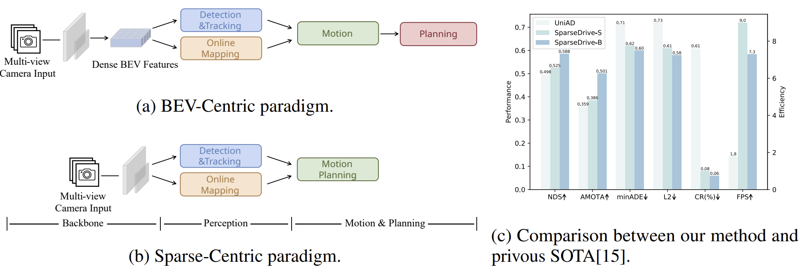
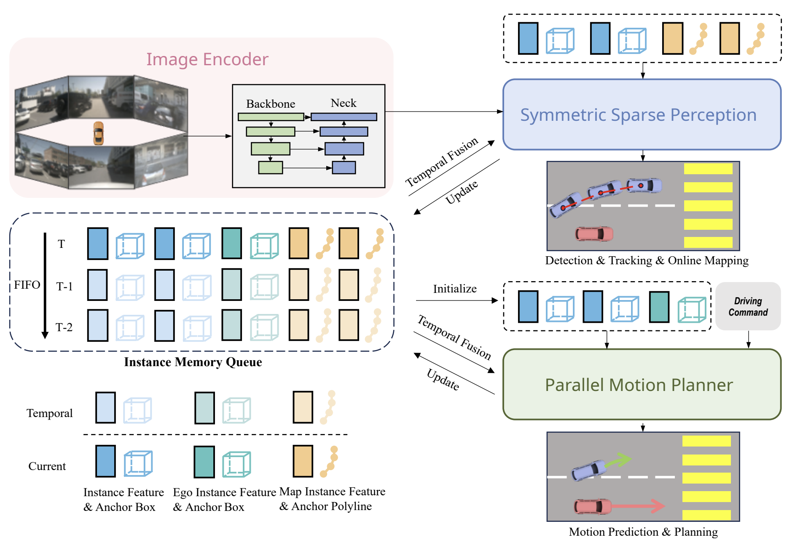
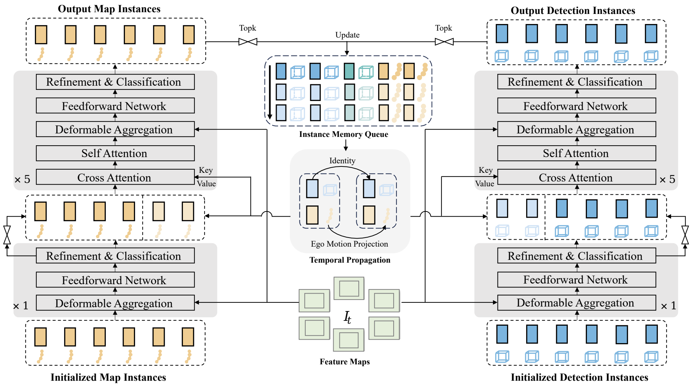

# SparseDrive: 基于稀疏场景表示的端到端自动驾驶

## Abstract

成熟的模块化自动驾驶系统通常被解耦为感知、预测、规划等多个独立任务，这会导致模块间出现信息丢失与误差累积的问题。与之不同，**端到端范式将多任务整合到一个完全可微分的框架中，能够以规划为导向进行优化。尽管端到端范式具有巨大潜力，但现有方法在性能与效率方面仍不尽如人意，尤其在规划安全性上表现欠佳**。作者认为，这一问题源于计算成本高昂的鸟瞰图（BEV）特征，以及预测与规划任务的设计过于简单直接。

为此，作者对端到端自动驾驶的稀疏表示方法展开研究，并重新审视了任务设计思路，提出了一种名为 SparseDrive 的新型范式。具体而言，**SparseDrive** 由**对称稀疏感知模块**与**并行运动规划器**两部分构成：其中，**稀疏感知模块采用对称模型架构**，**将检测、跟踪与在线建图任务统一起来，学习驾驶场景的全稀疏表示**；在运动预测与规划方面，作者发现这两项任务存在高度相似性，据此设计了并行运动规划器。基于该并行设计（将规划建模为多模态问题），作者进一步提出了一种**分层规划选择策略** —— 该策略融入了碰撞感知重评分模块，能够筛选出合理且安全的轨迹作为最终规划输出。

实验表明，凭借上述高效设计，SparseDrive 在所有任务的性能上均大幅超越现有最优方法，同时实现了更高的训练与推理效率。相关代码已开源至https://github.com/swc-17/SparseDrive，以期为后续研究提供支持。

## 1 Introduction

传统自动驾驶系统的典型特征是将任务按顺序划分为多个模块。尽管这种模式在可解释性与误差追踪方面具有优势，但**不可避免地会导致连续模块间出现信息丢失与误差累积**，进而限制系统发挥最优性能的潜力。

近年来，端到端驾驶范式逐渐成为极具前景的研究方向。该范式将所有任务整合到一个整体模型中，能够**围绕规划这一最终目标进行优化**。然而，现有方法 [15, 20] 在性能与效率方面仍存在不足。一方面，以往方法依赖计算成本高昂的鸟瞰图（BEV）特征；另一方面，预测与规划任务的设计过于简单直接，制约了模型性能的提升。作者将上述方法归纳为 “以 BEV 为中心” 的范式，如图 1a 所示。

为充分挖掘端到端范式的潜力，作者重新审视了现有方法的任务设计，并认为现有研究忽略了**运动预测**与**规划**之间存在的三个主要共性：

+ （1）运动预测旨在预测周边智能体与自车的未来轨迹，规划任务同样以此为目标，二者均需考虑道路智能体间的高阶双向交互。但以往方法通常对运动预测与规划采用顺序化设计，忽略了自车对周边智能体的影响。
+ （2）准确预测未来轨迹既需要用于场景理解的语义信息，也需要用于预测智能体未来运动的几何信息，而这两类信息对运动预测与规划任务均适用。尽管上游感知任务已为周边智能体提取了这些信息，但**自车相关的此类信息却未得到重视**。
+ （3）运动预测与规划均属于具有固有不确定性的多模态问题，但以往方法在规划任务中仅能输出确定性轨迹。

为此，作者提出了 **SparseDrive**—— 一种如图 1b 所示的 “以稀疏为核心” 的范式。具体而言，SparseDrive 由对称稀疏感知模块与并行运动规划器两部分组成。

以解耦的实例特征与几何锚点作为单个实例（动态道路智能体或静态地图元素）的完整表示，对称稀疏感知模块采用对称模型架构，将检测、跟踪与在线建图任务统一起来，进而学习得到驾驶场景的全稀疏表示。在并行运动规划器中，首先通过自车实例初始化模块获取具备语义与几何感知能力的自车实例；随后，结合该自车实例与稀疏感知模块输出的周边智能体实例，同步执行运动预测与规划任务，为所有道路智能体生成多模态轨迹。为确保规划结果的合理性与安全性，作者采用了一种融入碰撞感知重评分模块的分层规划选择策略，从多模态候选轨迹中筛选出最终的规划轨迹。

凭借上述高效设计，SparseDrive 充分释放了端到端自动驾驶的巨大潜力，如图 1c 所示。在未引入冗余设计的情况下，作者提出的基础模型 SparseDrive-B 将平均 L2 误差大幅降低 19.4%（从 0.72 米降至 0.58 米），碰撞率降低 71.4%（从 0.21% 降至 0.06%）。与此前的最优（SOTA）方法 UniAD [15] 相比，作者提出的小型模型 SparseDrive-S 在所有任务中均实现了更优性能，同时训练速度提升 7.2 倍（从 144 小时缩短至 20 小时），推理速度提升 5.0 倍（从 1.8 帧 / 秒提升至 9.0 帧 / 秒）。

**作者的研究工作主要贡献总结如下：**

- 针对端到端自动驾驶，探索了稀疏场景表示方法，**提出了一种名为 SparseDrive 的 “以稀疏为核心” 范式，该范式通过稀疏实例表示实现了多任务的统一**。
- 重新梳理了运动预测与规划之间的高度相似性，并据此设计了并行运动规划器；进一步提出了一种融入碰撞感知重评分模块的分层规划选择策略，以提升规划性能。
- 在具有挑战性的 **nuScenes** [1] 基准测试中，SparseDrive 在所有评价指标上均超越了此前的最优方法，尤其在碰撞率这一安全关键指标上表现突出，同时保持了远高于现有方法的训练与推理效率。

## 2 Related Work

### 2.1 Multi-view 3D Detection

**多视图三维检测是自动驾驶系统安全运行的前提**。LSS [42] 方法通过深度估计将图像特征提升至三维空间，并将特征映射到鸟瞰图（BEV）平面。后续研究将 “提升 - 映射”（`lift-splat`）操作应用于三维检测领域，在检测精度 [18, 16, 25, 24] 与效率 [37, 17] 方面均取得了显著提升。

部分研究 [26, 48, 21, 5] 预先定义一组鸟瞰图查询（`BEV queries`），并将其投影到透视视图中进行特征采样。另有一类研究则致力于消除对密集鸟瞰图特征的依赖：**PETR 系列**方法 [35, 36, 47] 引入三维位置编码与全局注意力机制，以隐式方式学习视图转换；**Sparse4D 系列方法** [31, 32, 33] 则**在三维空间中设置显式锚点**，**将锚点投影到图像视图以聚合局部特征，并通过迭代方式对锚点进行优化**。

### 2.2 End-to-End Tracking

大多数多目标跟踪（MOT）方法采用 “检测后跟踪”（`tracking-by-detection`）模式，该模式依赖数据关联等后处理步骤，无法充分发挥神经网络的能力。受文献 [2] 中 “目标查询（`object queries`）” 思想的启发，部分研究 [52, 55, 50, 41, 46, 54] 引入 “跟踪查询（`track queries`）”，以流式方式对被跟踪实例进行建模。其中，**MOTR** [52] 提出了 “跟踪片段感知的标签分配（`tracklet-aware label assignment`）” 策略，该策略强制跟踪查询持续检测同一目标，但存在检测与关联之间的冲突问题 [55, 50]。而 Sparse4Dv3 则证明，经时间传播得到的实例已具备身份一致性（identity consistency），仅通过简单的身份（ID）分配流程，就能实现最优（SOTA）的跟踪性能。

### 2.3 Online Mapping

由于高清地图（HD map）构建成本高昂且需投入大量人力，在线建图被提出作为高清地图的替代方案。**HDMapNet** [23] 将鸟瞰图（BEV）语义分割与后处理步骤相结合，以获取矢量化的地图实例。**VectorMapNet** [34] 采用两阶段自回归 Transformer 实现在线建图。**MapTR** [29] 将地图元素建模为具有等效排列性的点集，从而避免了地图元素定义模糊的问题。**BeMapNet** 则通过分段贝塞尔曲线（piecewise Bezier curve）描述地图元素的细节信息。**StreamMapNet** [51] 引入鸟瞰图融合（BEV fusion）与查询传播（query propagation）机制，用于地图的时间维度建模。

### 2.4 End-to-End Motion Prediction

**为避免传统流程中的级联误差**，端到端运动预测方法被提出。**FaF** [40] 采用单个卷积网络，同时预测当前边界框与未来边界框。**IntentNet** [3] 进一步实现了对高层行为与长时轨迹的双重推理。**PnPNet** [28] 引入在线跟踪模块，通过聚合轨迹级特征来辅助运动预测。**ViP3D** [10] 以图像和高清地图（HD map）为输入，利用智能体查询（agent queries）完成跟踪与预测任务。**PIP** [19] 则用局部矢量化地图替代了人工标注的高清地图。

### 2.5 End-to-End Planning

端到端规划的研究自上世纪便已开展 [43]。早期研究 [6, 7, 44] 省略了感知、运动预测等中间任务，不仅缺乏可解释性，且难以优化。部分研究 [14, 4, 45, 8] 基于感知或预测结果构建显式代价地图（cost map）以提升可解释性，但需依赖人工设计规则，从代价最小的候选轨迹中筛选最优轨迹。近年来，**UniAD** [15] 提出**统一查询（unified query）**设计，将多类任务整合到一个以目标为导向的模型中，在感知、预测与规划任务上均实现了优异性能。**VAD [20] 采用矢量化表示**，用于场景学习与规划约束构建。**GraphAD** [56] 则利用图模型（graph model），建模交通场景中的复杂交互关系。**FusionAD** [49] 将端到端驾驶扩展至多传感器输入场景。**然而，现有方法多聚焦于场景学习，对预测与规划任务采用简单直接的设计思路，未充分考虑二者间的相似性，这在很大程度上限制了模型性能的提升。**

`图 2：SparseDrive 的整体框架SparseDrive 首先将多视图图像编码为特征图，随后通过对称稀疏感知模块学习场景的稀疏表示，最后以并行方式执行运动预测与规划任务。此外，为实现时间维度建模，作者设计了一个实例记忆队列（instance memory queue）注：“instance memory queue” 是该框架中用于时序信息处理的关键组件，其核心作用是存储历史帧中的目标实例特征（如过往帧中周边车辆、行人的稀疏特征），并在当前帧的感知、预测过程中调用这些历史信息，从而提升目标跟踪的连续性与运动预测的准确性，避免因单帧信息不足导致的决策偏差。`

## 3 Method 

### 3.1 Overview

SparseDrive 的整体框架如图 2 所示。具体而言，SparseDrive 由三部分构成：**图像编码器（image encoder）**、**对称稀疏感知模块（symmetric sparse perception）**与**并行运动规划器（parallel motion planner）**。

给定多视图图像后，包含骨干网络（backbone network）与颈部网络（neck）的图像编码器首先将图像编码为多视图多尺度特征图，记为 $I = \left\{ I_s \in \mathbb{R}^{N \times C \times H_s \times W_s} \mid 1 \leq s \leq S \right\}$，其中 S 代表尺度数量，N 代表相机视图数量。在对称稀疏感知模块中，特征图 $I$ 被聚合为两组实例，用于学习驾驶场景的稀疏表示。这两组实例分别对应周边智能体（surrounding agents）与地图元素（map elements），它们将被输入至并行运动规划器中，与初始化后的自车实例（ego instance）进行交互。运动规划器会同步预测周边智能体与自车的多模态轨迹，并通过分层规划选择策略（hierarchical planning selection strategy）筛选出安全轨迹，作为最终的规划结果。

### 3.2 Symmetric Sparse Perception

如图 3 所示，稀疏感知模块的模型结构具有结构对称性，该模块将检测、跟踪与在线建图任务统一整合在一起。

**稀疏检测（Sparse Detection）** 周边智能体通过一组实例特征 $F_d \in \mathbb{R}^{N_d \times C}$ 与锚框 $B_d \in \mathbb{R}^{N_d \times 11}$表示，其中 $N_d$ 为锚框数量，$C$ 为特征通道维度。每个锚框包含位置、尺寸、偏航角与速度信息，具体格式定义为：
$$
\{x, y, z, ln w, ln h, ln l,sin yaw, cos yaw, vx, vy, vz\}
$$

**稀疏检测分支**包含 $N_{\text{dec}}$ 个解码器，其中包括 1 个非时序解码器和 $N_{\text{dec}} - 1$ 个时序解码器。每个解码器均以特征图 $I$、实例特征 $F_d$ 和锚框 $B_d$ 作为输入，输出更新后的实例特征与优化后的锚框。非时序解码器以随机初始化的实例为输入，而时序解码器的输入则同时来自当前帧与历史帧。

具体而言，**非时序解码器由三个子模块构成**：**可变形聚合**（deformable aggregation）、**前馈网络（FFN）**以及**用于锚框优化与类别分类的输出层**。可变形聚合模块会围绕锚框 $B_d$ 生成固定或可学习的关键点，并将这些关键点投影到特征图 $I$ 上进行特征采样。实例特征 $F_d$会与采样得到的特征相加以完成更新，最终在输出层负责预测目标的分类分数与锚框的偏移量。

**时序解码器**在非时序解码器的基础上，额外**增加了两个多头注意力层**：一个是 “历史帧时序实例与当前帧实例之间的时序交叉注意力层”，另一个是 “当前帧实例间的自注意力层”。在多头注意力层中，锚框会被转换为高维锚框嵌入向量 $E_d \in \mathbb{R}^{N_d \times C}$，并作为位置编码`（positional encoding）`使用。

`图 3：对称稀疏感知的模型架 构该架构采用对称结构，将检测、跟踪与在线建图任务统一整合。`

**稀疏在线建图（Sparse Online Mapping）**在线建图分支与检测分支采用相同的模型结构，仅在实例定义上存在差异。对于静态地图元素，其锚框被定义为包含 $N_p$ 个点的折线（`polyline`），具体形式为：

$$
\left\{ x_0, y_0, x_1, y_1, \dots, x_{N_p-1}, y_{N_p-1} \right\}
$$

如此一来，所有地图元素均可通过地图实例特征 $F_m \in \mathbb{R}^{N_m \times C}$  与锚框折线 $L_m \in \mathbb{R}^{N_m \times N_p \times 2}$表示，其中 $N_m$为锚框折线的数量。

**稀疏跟踪（Sparse Tracking）**在跟踪任务上，沿用 Sparse4Dv3 [33] 的身份（ID）分配流程：当某个实例的检测置信度超过阈值 $T_{\text{thresh}}$ 时，该实例会被锁定为特定目标并分配一个身份标识（ID），此 ID 在整个时间传播过程中保持不变。该跟踪策略无需任何跟踪约束，最终为稀疏感知模块带来简洁、优雅的对称设计。

### 3.3 Parallel Motion Planner